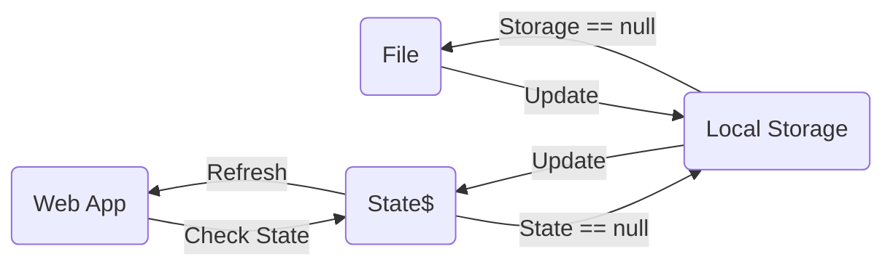

## 👩‍🚀 Senior Front-End Engineer Take-Home Project  **(Applicant: Hossein Ganjyar )** 
This is document for my approach to do this assessment that is designed by **Angular v.17** 

## My Approach
To better view and working with this practice, I decided to break images to two major sections: 
`Assigned` & `UnAssigned`

##  Storage
To save data I needed to split name of images to a list and save them differently in dedicated Q on **local storage**: 
1- `q_assigned` 
2- `q_unAssigned`

## States
For preserve states on web, I used **Subjects** on a shared service. 

## Components
All of components are **standalone**, so application is based on three of it: 
`assigned`
`images`
`un-assigned`

## Shared
There are shared objects in the project: 
***Components***
`image` Show every image and do actions in itself. This is repeated by list of image's name.

***Services***
`alert` Show message once an action occurred 
`file` Work with files like paths.txt
`state` Management of states
`storage` Management of data on local storage

## Show by diagrams

